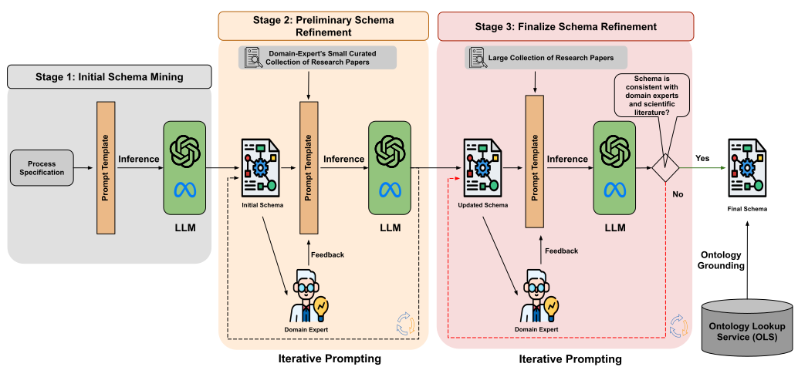

.. Schema-Miner documentation master file, created by
   sphinx-quickstart on Tue Feb  4 21:49:19 2025.
   You can adapt this file completely to your liking, but it should at least
   contain the root `toctree` directive.

.. raw:: html

   

        
        
        
        
    

    

LLMs4SchemaDiscovery: A Human-in-the-Loop Workflow for Scientific Schema Mining with Large Language Models
**********************************************************************************************************

Schema-miner is novel framework that leverages Large Language Models (LLMs) and continuous human feedback to automate and enhance schema mining task. Through an iterative process, the framework uses LLMs to extract and organize properties from unstructured text, refine schemas with expert input, and incorporate domain-specific ontologies to add semantic knowledge.

Below is the workflow diagram of Schema-Miner.

   **Figure 1.** Overview of the LLMs4SchemaDiscovery workflow implemented in schemaminer. Stage 1 (gray box) generates an initial schema from domain specifications. Stage 2 (orange box) refines the schema using a small, expert-curated set of papers and optional feedback. Stage 3 (red box) finalizes the schema with a larger, non-curated collection of papers. The workflow iteratively updates the schema and concludes by grounding schema properties to ontologies.

.. toctree::
   :maxdepth: 2
   :caption: Getting Started
   :glob:
   :hidden:

   gettingstarted/installation
   gettingstarted/quickstart

.. toctree::
   :maxdepth: 2
   :caption: Package Reference
   :glob:
   :hidden:

   packagereference/schema-extractor
   packagereference/ontology_grounding
   packagereference/pdf_extractor

Citing this Work
*******************

If you use ``schema-miner`` in your research or applications, please cite the following paper:

Sameer Sadruddin, Jennifer D’Souza, Eleni Poupaki, Alex Watkins, Hamed Babaei Giglou, Anisa Rula, Bora Karasulu, Sören Auer, Adrie Mackus, and Erwin Kessels.  
**LLMs4SchemaDiscovery: A Human-in-the-Loop Workflow for Scientific Schema Mining with Large Language Models.**  
In *The Semantic Web – ESWC 2025*, Springer, Cham, pp. 244–261.  
`https://doi.org/10.1007/978-3-031-94578-6_14 <https://doi.org/10.1007/978-3-031-94578-6_14>`_

BibTeX
**********

.. code-block:: text
   
   @InProceedings{10.1007/978-3-031-94578-6_14,
   author    = {Sadruddin, Sameer and D'Souza, Jennifer and Poupaki, Eleni and Watkins, Alex and Babaei Giglou, Hamed and Rula, Anisa and Karasulu, Bora and Auer, S{\"o}ren and Mackus, Adrie and Kessels, Erwin},
   editor    = {Curry, Edward and Acosta, Maribel and Poveda-Villal{\'o}n, Maria and van Erp, Marieke and Ojo, Adegboyega and Hose, Katja and Shimizu, Cogan and Lisena, Pasquale},
   title     = {LLMs4SchemaDiscovery: A Human-in-the-Loop Workflow for Scientific Schema Mining with Large Language Models},
   booktitle = {The Semantic Web},
   year      = {2025},
   publisher = {Springer Nature Switzerland},
   address   = {Cham},
   pages     = {244--261},
   isbn      = {978-3-031-94578-6},
   }

License
**********

This project is open source and distributed under the terms of the **MIT License**.  

The full license text is available in the `MIT License <https://github.com/sciknoworg/schema-miner/blob/main/LICENSE.txt>`_ file in the repository.